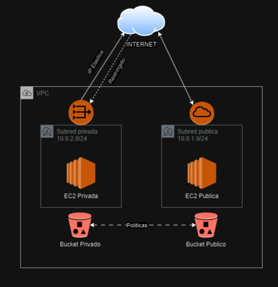
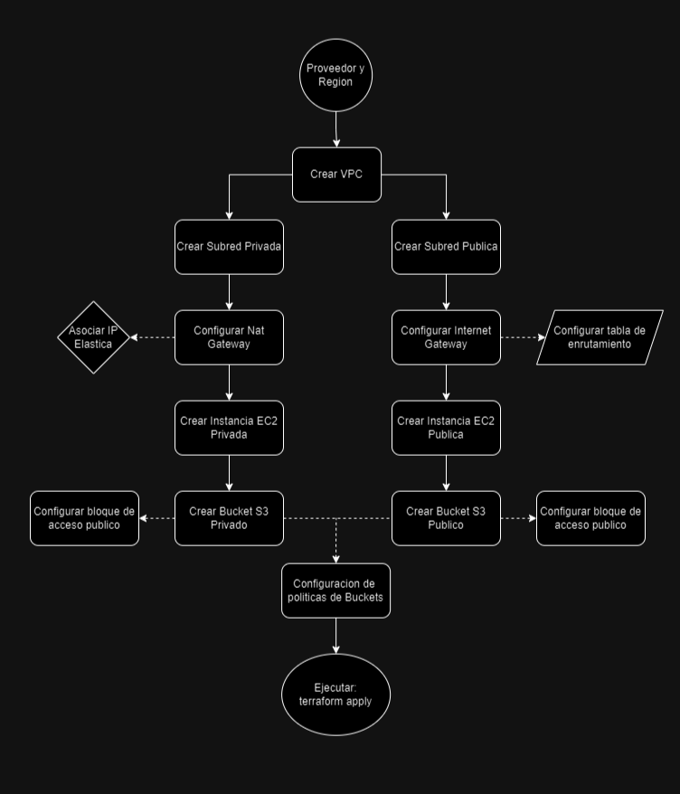

[<u>Diagrama de Infraestructura</u>](#diagrama-de-infraestructura)

> [<u>Intro</u>](#intro)

[<u>Diagrama de flujo de trabajo</u>](#diagrama-de-flujo-de-trabajo)

> [<u>Procedimiento</u>](#procedimiento)

[<u>Documentación de los archivos Terraform</u>](#documentación-de-los-archivos-terraform)

> [<u>Archivo “vpc.tf”</u>](#archivo-vpc.tf)
>
> [<u>Establecer proveedor y región donde alojar los
> recursos</u>](#establecer-proveedor-y-región-donde-alojar-los-recursos)
>
> [<u>Recurso VPC</u>](#recurso-vpc)
>
> [<u>Recurso Subred pública</u>](#recurso-subred-pública)
>
> [<u>Recurso Internet Gateway</u>](#recurso-internet-gateway)
>
> [<u>Recurso Tabla de rutas</u>](#recurso-tabla-de-rutas)
>
> [<u>Recurso Ruta</u>](#recurso-ruta)
>
> [<u>Recurso Asociacion de tabla de
> rutas</u>](#recurso-asociacion-de-tabla-de-rutas)
>
> [<u>Recurso Subred privada</u>](#recurso-subred-privada)
>
> [<u>Recurso IP elástica</u>](#recurso-ip-elástica)
>
> [<u>Recurso NAT Gateway</u>](#recurso-nat-gateway)
>
> [<u>Recurso Ruta</u>](#recurso-ruta-1)
>
> [<u>Archivo “ec2.tf”</u>](#archivo-ec2.tf)
>
> [<u>Recurso Instancia EC2 pública</u>](#recurso-instancia-ec2-pública)
>
> [<u>Recurso Grupo de seguridad</u>](#recurso-grupo-de-seguridad)
>
> [<u>Recurso Instancia EC2 privada</u>](#recurso-instancia-ec2-privada)
>
> [<u>Archivo “buckets.tf”</u>](#archivo-buckets.tf)
>
> [<u>Recurso bucket S3 privado</u>](#recurso-bucket-s3-privado)
>
> [<u>Recurso Bloque de acceso público (para el bucket
> privado)</u>](#recurso-bloque-de-acceso-público-para-el-bucket-privado)
>
> [<u>Recurso bucket S3 público</u>](#recurso-bucket-s3-público)
>
> [<u>Recurso Bloque de acceso público (para el bucket
> publico)</u>](#recurso-bloque-de-acceso-público-para-el-bucket-publico)
>
> [<u>Recurso Política del bucket
> privado</u>](#recurso-política-del-bucket-privado)
>
> [<u>Política del bucket público</u>](#política-del-bucket-público)
>
> [<u>Anexo: Elastic Container Registry
> (ECR)</u>](#anexo-elastic-container-registry-ecr)
>
> [<u>Archivo “ecr.tf”</u>](#archivo-ecr.tf)
>
> [<u>Recurso ECR</u>](#recurso-ecr)
>
> [<u>Recurso Politica de ECR</u>](#recurso-politica-de-ecr)

[<u>Despliegue</u>](#despliegue)

> [<u>Paso 1: Instalar AWS CLI y
> Terraform</u>](#paso-1-instalar-aws-cli-y-terraform)
>
> [<u>Paso 2: Inicializar Terraform</u>](#paso-2-inicializar-terraform)
>
> [<u>Paso 3: Autenticación a AWS</u>](#paso-3-autenticación-a-aws)
>
> [<u>Paso 4: Aplicar la
> infraestructura</u>](#paso-4-aplicar-la-infraestructura)

## 

#  

# Diagrama de Infraestructura

## 

##  

## Intro

La infraestructura que se implementará consta de la creación de una VPC en AWS, llamada "MiVPC", con el rango de direcciones IP 10.0.0.0/16, la cual contendrá dos subredes (una privada y otra pública) con los rangos de direccionamiento IP 10.0.2.0/24 y 10.0.1.0/24, respectivamente.

Ambas subredes tendrán acceso a Internet, pero la red privada va a restringir el tráfico entrante de Internet, por lo que se implementará para esta un NAT Gateway con dirección IP elástica asociada. Mientras tanto, la subred pública permitirá tanto el tráfico saliente como entrante (de cualquier IP), por lo que se le implementará un Internet Gateway con su tabla de enrutamiento configurada para permitir un rango de direcciones IP sin restricciones (0.0.0.0/0).

En cada subred se creará una instancia de Amazon EC2, las cuales permitirán ejecutar aplicaciones y sistemas operativos virtualizados de manera escalable y altamente disponible.

Además, se generará la configuración y asociación mediante políticas de dos Buckets S3 (uno privado y otro público) para utilizarlos como volúmenes de almacenamiento de datos de nuestras subredes de manera segura, escalable y con disponibilidad garantizada.

En última instancia, se agregará un anexo como guía de despliegue de un servicio de registro de contenedores al final de la documentación. Este no forma parte de la infraestructura primaria, pero puede ser de utilidad si se requiere utilizar contenedores para la ejecución de aplicaciones dentro de las instancias EC2.

En resumen, la implementación de esta infraestructura básica servirá como punto de partida para futuros despliegues de aplicaciones y servicios en la nube de AWS, permitiendo aprovechar al máximo los recursos y capacidades ofrecidos por esta plataforma.

#  

# Diagrama de flujo de trabajo

# 

##  

## Procedimiento

1.  **Establecer proveedor y región**: En este paso, debes identificar
    el proveedor de servicios en la nube que deseas utilizar (en este
    caso, AWS) y la región geográfica en la que deseas desplegar tus recursos.

2.  **Crear la VPC**: Configurar una VPC que permita lanzar recursos de
    AWS de forma virtual a la red que desplegamos. Se deben configurar
    los atributos de la VPC con su bloque CIDR.

3.  **Crear subred privada**: En una VPC, las subredes privadas son
    aquellas a las que no se puede acceder directamente desde Internet.
    Se debe definir una subred privada con su propio bloque CIDR y
    asociarla a la VPC.

4.  **Crear subred pública**: A diferencia de la subred privada, la
    subred pública debe ser accesible desde Internet. Se debe definir
    una subred pública con su propio bloque CIDR y asociarla a la VPC.

5.  **Configurar NAT Gateway**: Se debes configurar un NAT Gateway que
    actúe como intermediario para el tráfico saliente, restringiendo el
    tráfico entrante a la subred privada y para permitir que la
    instancia en las subred privada acceda a Internet, por ejemplo; para
    actualizaciones.

6.  **Asociar IP elástica**: Asocia una IP elástica al NAT Gateway para
    que la instancia en la subred privada pueda tener una dirección IP
    fija para comunicarse con Internet.

7.  **Configurar Internet Gateway**: Para habilitar la conectividad a
    Internet desde la subred pública dentro de la VPC, se debe
    configurar un Internet Gateway y attacharlo a la VPC.

8.  **Configurar tabla de enrutamiento**: Definir las reglas de
    enrutamiento en la VPC para dirigir el tráfico correctamente entre
    la subred pública y el Internet Gateway.

9.  **Crear Instancia EC2 Privada**: En la subred privada, lanzar una
    instancia EC2 que contenga los atributos de tipo de instancia y AMI
    especificados por AWS.

10. **Crear Instancia EC2 Pública**: En la subred pública, lanza una
    instancia EC2 con libre acceso a Internet y atribuirle las
    especificaciones ya mencionadas en la anterior instancia.

11. **Crear Bucket S3 Privado**: Crea un bucket S3 que solo sea
    accesible desde la VPC.

12. **Configurar Bloque de acceso público**: Establece la configuración
    de “Bloqueo de acceso público” tanto para el bucket privado como el
    público

13. **Crear Bucket S3 Público**: Crea un bucket S3 que sea accesible
    públicamente a través de Internet.

14. **Configurar Políticas de Buckets**: Establece políticas de acceso
    en los buckets S3 para que puedan compartir datos entre ellos

15. **Ejecutar: terraform apply**: Realizar validación de errores de
    sintaxis del código con el comando *terraform validate* y verifica
    el plan de cambios que realizará el código con el comando *terraform
    plan*. Si luego de esto todo parece en orden ya se podrá ejecutar el
    comando *terraform apply* para aplicar las configuraciones definidas
    en los archivos de configuración de Terraform y desplegar la
    infraestructura definida en AWS.

Cada uno de estos pasos es crucial para asegurarse de que la
infraestructura en la nube de AWS esté bien configurada y sea segura.

#  

# Documentación de los archivos Terraform

## Archivo “vpc.tf”

### Establecer proveedor y región donde alojar los recursos
```
provider "aws" {

region = "us-east-1"

}
```
- *provider "aws" { region = "us-east-1" }*: define y configura el
  proveedor de AWS en la región “N.Virginia” para alojar los recursos
  creados en el archivo.

### Recurso VPC
```
resource "aws_vpc" "test_vpc" {

cidr_block = "10.0.0.0/16"

instance_tenancy = "default"

tags = {

Name = "MiVPC"

}

}
```
<u>Objetivo</u>: Este código debe crear un recurso de tipo “aws_vpc”
llamado “test_vpc” y configurar una nueva Virtual Private Cloud (VPC)
utilizando un bloque CIDR específico y asignando etiquetas
personalizadas

- *resource "aws_vpc" "test_vpc" {*: indica que estamos definiendo un
  nuevo recurso de tipo “aws_vpc” llamado “test_vpc”. Esto significa que
  vamos a crear una nueva VPC en AWS.

<!-- -->

- *cidr_block = "10.0.0.0/16"*: establece la propiedad cidr_block en
  “10.0.0.0/16”. La propiedad cidr_block define el bloque CIDR que se
  utilizará para esta VPC, lo cual determina el rango de direcciones IP
  disponibles para los recursos dentro de la VPC.

- *instance_tenancy = "default"*: especifica la política de colocación
  de instancias dentro de la VPC. El valor "default" indica que las
  instancias lanzadas en esta VPC utilizarán la política de colocación
  predeterminada de AWS.

<!-- -->

- *tags = {Name = "MiVPC"}*: define la etiqueta asociada a esta VPC
  utilizando un mapa con pares clave-valor. En este caso, hemos definido
  una etiqueta llamada “Name” con el valor “MiVPC”.

### Recurso Subred pública
```
resource "aws_subnet" "public_subnet" {

vpc_id = aws_vpc.test_vpc.id

cidr_block = "10.0.1.0/24"

availability_zone = "us-east-1a"

tags = {

Name = "RedPublica"

}

}
```
<u>Objetivo</u>: Este código debe crear un recurso de tipo “aws_subnet”
llamado “public_subnet” y configurar una nueva subred pública dentro de
la VPC previamente creada. Además, se debe especificar el bloque CIDR y
la zona de disponibilidad donde se creará esta subred y también asignar
los “tags”

- *resource "aws_subnet" "public_subnet" {*: indica que estamos
  definiendo un nuevo recurso de tipo “aws_subnet” llamado
  “public_subnet”. Esto significa que vamos a crear una nueva subred
  pública en AWS.

<!-- -->

- *vpc_id = aws_vpc.test_vpc.id*: establece la asociación con la VPC
  haciendo referencia a su ID. Utilizar “aws_vpc.test_vpc.id” para
  obtener el ID de la VPC declarada anteriormente.

<!-- -->

- *cidr_block = "10.0.1.0/24"*: establece la propiedad “cidr_block” en
  “10.0.1.0/24”. La propiedad “cidr_block” define el bloque CIDR que se
  utilizará para esta subred, lo cual determina el rango de direcciones
  IP disponibles para los recursos dentro de la subred.

<!-- -->

- *availability_zone = "us-east-1a"*: establece la propiedad
  “availability_zone” en “us-east-1a”. La propiedad “availability_zone”
  indica la zona de disponibilidad donde se creará esta subred dentro de
  la región de North Virginia.

<!-- -->

- *tags = {Name = "RedPublica"}*: define la etiqueta asociada a esta
  subred utilizando un mapa con pares clave-valor. En este caso, hemos
  definido una etiqueta llamada “Name” con el valor “RedPublica”.

### Recurso Internet Gateway
```
resource "aws_internet_gateway" "internet_gateway" {

vpc_id = aws_vpc.test_vpc.id

}
```
<u>Objetivo</u>: Este código debe crear un recurso
“aws_internet_gateway” llamado “internet_gateway” y asociarlo con la VPC
previamente creada utilizando su ID proporcionado por
“aws_vpc.test_vpc.id”. Esta puerta de enlace a Internet es necesaria
para permitir el tráfico desde y hacia Internet para los recursos dentro
de la subred pública.

- *resource "aws_internet_gateway" "internet_gateway" {*: indica que
  estamos definiendo un nuevo recurso de tipo “aws_internet_gateway”
  llamado “internet_gateway”. Esto significa que vamos a crear una
  puerta de enlace a Internet para la subred pública.

<!-- -->

- *vpc_id = aws_vpc.test_vpc.id*: establece la asociación con la VPC
  haciendo referencia a su ID. Utilizar “aws_vpc.test_vpc.id” para
  obtener el ID de la VPC declarada anteriormente.

### Recurso Tabla de rutas
```
resource "aws_route_table" "route_table" {

vpc_id = aws_vpc.test_vpc.id

}
```
<u>Objetivo</u>: Estas líneas deben crear la tabla de enrutamiento que
se asocia a la subnet pública para posibilitar el tráfico que está
necesite

- *resource "aws_route_table" "route_table" {*: define un nuevo recurso
  de tabla de enrutamiento. “aws_route_table” indica que este recurso es
  una tabla de enrutamiento en AWS, y "route_table" es el nombre de
  referencia que se le asigna al recurso.

- *vpc_id = aws_vpc.test_vpc.id*: especifica el ID de la VPC asociada a
  la tabla de enrutamiento. “aws_vpc.test_vpc” se refiere al recurso VPC
  creado anteriormente, y “.id” accede al atributo ID de ese recurso.
  Esto garantiza que esta tabla de enrutamiento esté asociada a la VPC
  requerida.

### Recurso Ruta
```
resource "aws_route" "internet_access" {

route_table_id = aws_route_table.route_table.id

destination_cidr_block = "0.0.0.0/0"

gateway_id = aws_internet_gateway.internet_gateway.id

}
```
<u>Objetivo</u>: Este código debe crear un recurso de tipo “aws_route”
llamado “internet_access”, que se utiliza para configurar una ruta en la
tabla de enrutamiento asociada a la subred pública. Esta ruta permitirá
dirigir todo el tráfico saliente hacia el Internet a través del Internet
Gateway.

- *resource "aws_route" "internet_access" {*: define un nuevo recurso de
  tipo “aws_route” llamado “internet_access”. Esto implica que vamos a
  crear una ruta en la tabla de enrutamiento para permitir el acceso a
  internet.

<!-- -->

- *route_table_id = aws_subnet.public_subnet.route_table.id*: establece
  la propiedad “route_table_id” igual al ID de la tabla de enrutamiento
  asociada a la subred pública creada anteriormente
  (“aws_subnet.public_subnet”). Utilizar
  “aws_subnet.public_subnet.route_table.id” para obtener el ID de la
  tabla de enrutamiento.

<!-- -->

- *destination_cidr_block = "0.0.0.0/0"*: establece la propiedad
  “destination_cidr_block” igual a “0.0.0.0/0”. Esto especifica que esta
  ruta es una ruta predeterminada o ruta por defecto, lo que significa
  que se utilizará para enrutar todo el tráfico que no tenga una ruta
  específica definida.

<!-- -->

- *gateway_id = aws_internet_gateway.internet_gateway.id*: establece la
  asociacion con el recurso (“aws_internet_gateway.internet_gateway”)
  creado anteriormente mediante su ID. Utilizar
  “aws_internet_gateway.internet_gateway.id” para extraer el ID

### Recurso Asociacion de tabla de rutas
```
resource "aws_route_table_association" "rt_association" {

subnet_id = aws_subnet.public_subnet.id

route_table_id = aws_route_table.route_table.id

}
```
<u>Objetivo</u>: Estas líneas deben crear la asociación entre la tabla
de enrutamiento y la subred pública para dirigir el tráfico a través de
la tabla de enrutamiento especificada.

- *resource "aws_route_table_association" "rt_association"*: define un
  nuevo recurso de asociación de tabla de enrutamiento en Terraform.
  Este recurso permite asociar una tabla de enrutamiento a una subred en
  una VPC.

- *subnet_id = aws_subnet.public_subnet.id*: especifica el ID de la
  subred pública a la que se asociará la tabla de enrutamiento.
  aws_subnet.public_subnet se refiere al recurso de subred pública
  creado anteriormente, y .id accede al atributo ID de ese recurso.

- *route_table_id = aws_route_table.route_table.id*: especifica el ID de
  la tabla de enrutamiento que se asociará a la subred pública.
  aws_route_table.route_table se refiere al recurso de tabla de
  enrutamiento creado anteriormente, y .id accede al atributo ID de ese
  recurso. Esta línea asegura que la tabla de enrutamiento creada se
  asocie a la subred pública.

### Recurso Subred privada
```
resource "aws_subnet" "private_subnet" {

vpc_id = aws_vpc.test_vpc.id

cidr_block = "10.0.2.0/24"

availability_zone = "us-east-1b"

tags = {

Name = "RedPrivada"

}

}
```
<u>Objetivo</u>: Este código debe crear otro recurso “aws_subnet”
llamado “private_subnet” y configurar una nueva subred privada dentro de
la misma VPC previamente creada usando su ID proporcionado por
“aws_vpc.test_vpc.id”. Se especifican también el bloque CIDR y la zona
de disponibilidad donde se creará esta subred privada y se asigna la
correspondiente etiqueta.

- *resource "aws_subnet" "private_subnet" {*: indica que estamos
  definiendo un nuevo recurso de tipo “aws_subnet” llamado
  “private_subnet”. Esto significa que vamos a crear otra subred, pero
  esta vez será una subred privada.

<!-- -->

- *vpc_id = aws_vpc.test_vpc.id*: establece la asociación con la VPC
  haciendo referencia a su ID. Utilizar “aws_vpc.test_vpc.id” para
  obtener el ID de la VPC declarada anteriormente.

<!-- -->

- *cidr_block = "10.0.2.0/24"*: establece la propiedad “cidr_block” en
  “10.0.2.0/24”. La propiedad “cidr_block” define el bloque CIDR que se
  utilizará para esta subred, lo cual determina el rango de direcciones
  IP disponibles para los recursos dentro de la subred.

<!-- -->

- *availability_zone = "us-east-1b"*: establece la propiedad
  “availability_zone” en “us-east-1b” (distinta a la AZ de la subred
  pública). La propiedad “availability_zone” indica la zona de
  disponibilidad donde se creará esta subred dentro de la región de
  North Virginia.

<!-- -->

- *tags = {Name = "RedPrivada"}*: define la etiqueta asociada a esta
  subred utilizando un mapa con pares clave-valor. En este caso, hemos
  definido una etiqueta llamada “Name” con el valor “RedPrivada”.

### Recurso IP elástica
```
resource "aws_eip" "elastic_ip" {}
```
<u>Objetivo</u>: Esta línea de código crea un recurso de dirección IP
elástica para proporcionar conectividad de salida a la instancia en la
subred privada a través del NAT Gateway

- *resource "aws_eip" "elastic_ip" {}*: define un nuevo recurso de
  dirección IP elástica. No se especifican atributos en esta línea, lo
  que significa que Terraform solicitará una dirección IP elástica
  automáticamente y la asociará a la cuenta.

### Recurso NAT Gateway
```
resource "aws_nat_gateway" "nat_gateway" {

allocation_id = aws_eip.elastic_ip.id

subnet_id = aws_subnet.public_subnet.id

}
```
<u>Objetivo</u>: En este caso, el código deberá crear el recurso
“aws_nat_gateway” para crear una nueva puerta de enlace tipo NAT
(Network Address Translation), la cual garantizara el control de tráfico
de datos entre Internet y la subred privada con los requisitos que le
corresponden a una subred de esta característica.

- *resource "aws_nat_gateway" "nat_gateway" {*: Define un nuevo recurso
  de NAT Gateway en Terraform. Este recurso se utiliza para crear un NAT
  Gateway en AWS, que proporciona conectividad de salida a instancias en
  subredes privadas dentro de una VPC.

- allocation_id = aws_eip.elastic_ip.id: Especifica la ID de asignación
  de la dirección IP elástica asociada al NAT Gateway.
  aws_eip.elastic_ip se refiere al recurso de dirección IP elástica
  creado anteriormente, y .id accede al atributo ID de ese recurso.

- subnet_id = aws_subnet.public_subnet.id: Especifica la ID de la subred
  pública en la que se creará el NAT Gateway. aws_subnet.public_subnet
  se refiere al recurso de subred pública creado anteriormente, y .id
  accede al atributo ID de ese recurso. Esto asegura que el NAT Gateway
  se cree en la subred pública especificada.

### Recurso Ruta
```
resource "aws_route" "nat_access" {

route_table_id = aws_route_table.route_table.id

destination_cidr_block = "0.0.0.0/0"

gateway_id = aws_nat_gateway.nat_gateway.id

}
```
<u>Objetivo</u>: Este código debe crear un recurso de tipo “aws_route”
llamado “acceso_internet”, que se utiliza para configurar una ruta en la
tabla de enrutamiento asociada a la subred pública. Esta ruta permitirá
el acceso a Internet desde esta subred.

<u>Objetivo</u>: Esta sección de código crea una regla de enrutamiento
en la tabla de enrutamiento para permitir el acceso a Internet a través
del NAT Gateway.

- *resource "aws_route" "nat_access" {*: define un nuevo recurso de
  regla de enrutamiento en Terraform. Este recurso se utiliza para crear
  una regla de enrutamiento en una tabla de enrutamiento creada
  anteriormente.

- *route_table_id = aws_route_table.route_table.id*: especifica el ID de
  la tabla de enrutamiento a la que se aplicará esta regla de
  enrutamiento, “aws_route_table.route_table” se refiere al recurso de
  tabla de enrutamiento creado anteriormente, y “.id” accede al atributo
  ID de ese recurso.

- *destination_cidr_block = "0.0.0.0/0"*: especifica el bloque CIDR de
  destino al que se aplicará esta regla de enrutamiento. En este caso,
  "0.0.0.0/0" representa todas las direcciones IP.

- *gateway_id = aws_nat_gateway.nat_gateway.id*: especifica el ID del
  NAT Gateway al que se enviará el tráfico que coincida con el bloque
  CIDR de destino. aws_nat_gateway.nat_gateway se refiere al recurso del
  NAT Gateway creado anteriormente, y “.id” accede al atributo ID de ese
  recurso. Esto asegura que el tráfico saliente hacia Internet sea
  dirigido a través del NAT Gateway especificado.

## Archivo “ec2.tf”

### Recurso Instancia EC2 pública
```
resource "aws_instance" "public_instance" {

ami = "ami-080e1f13689e07408"

instance_type = "t2.micro"

subnet_id = aws_subnet.public_subnet.id

key_name = "millave"

associate_public_ip_address = true

vpc_security_group_ids = \[aws_security_group.security_group.id\]

tags = {

Name = "InstanciaPublica"

}

}
```
<u>Objetivo</u>: Este código debe definir un recurso de tipo
“aws_instance” llamado “public_instance”, crear una nueva instancia EC2
utilizando una AMI específica, un tipo de instancia determinado y
asignando una etiqueta (“tag”). Se debe especificar la asociación a la
subred pública donde debe lanzarse la instancia y también a que grupo de
seguridad pertenece la instancia, se le asocia una dirección IP pública
por AWS y se le da el nombre de la llave para facilitar la conexión por
SSH a la instancia.

- *resource "aws_instance" "public_instance" {*: define un nuevo recurso
  de instancia de EC2 en AWS.

- *ami = "ami-080e1f13689e07408"*: especifica el ID de la AMI (Amazon
  Machine Image) que se utilizará para lanzar la instancia. En este
  caso, se utiliza una AMI específica que está preconfigurada con un
  sistema operativo y el software necesario.

- *instance_type = "t2.micro"*: especifica el tipo de instancia EC2 que
  se lanzará. En este caso, se utiliza una instancia de tipo “t2.micro”,
  que es una instancia de tamaño pequeño y está incluida en el nivel
  gratuito de AWS.

- *subnet_id = aws_subnet.public_subnet.id*: especifica la ID de la
  subred pública en la que se lanzará la instancia.
  “aws_subnet.public_subnet” se refiere al recurso de subred pública
  creado anteriormente, y “.id” accede al atributo ID de ese recurso.

- *key_name = "millave"*: especifica el nombre de la clave SSH que se
  utilizará para acceder a la instancia. Esto permite la autenticación
  segura a través de SSH.

- *associate_public_ip_address = true*: indica que se debe asociar
  automáticamente una dirección IP pública a la instancia. Esto permite
  que la instancia tenga conectividad a Internet.

- *vpc_security_group_ids = \[aws_security_group.security_group.id\]*:
  especifica el ID del grupo de seguridad que se asociará con la
  instancia. “aws_security_group.security_group” se refiere al recurso
  de grupo de seguridad que se creará posteriormente, y “.id” accede al
  atributo ID de ese recurso. Esto permite controlar el tráfico de red
  que puede llegar a la instancia.

- tags = { Name = "InstanciaPublica" }: Asigna etiquetas (tags) a la
  instancia para identificarla y organizarla. En este caso, se asigna
  una etiqueta con el nombre "InstanciaPublica", lo que facilita la
  identificación de la instancia en la consola de AWS y otros servicios.

### Recurso Grupo de seguridad
```
resource "aws_security_group" "security_group" {

name = "mi-security-group"

description = "MiGrupoDeSeguridad"

vpc_id = aws_vpc.test_vpc.id

ingress {

from_port = 0

to_port = 0

protocol = "-1"

cidr_blocks = \["0.0.0.0/0"\]

}

egress {

from_port = 0

to_port = 0

protocol = "-1"

cidr_blocks = \["0.0.0.0/0"\]

}

}
```
<u>Objetivo</u>: Crear un grupo de seguridad que permita todo el tráfico
entrante y saliente desde y hacia cualquier dirección IP, por cualquier
puerto y utilizando cualquier protocolo de red.

- *resource "aws_security_group" "security_group" {*: define un nuevo
  recurso de grupo de seguridad en Terraform. Este recurso se utiliza
  para crear y gestionar grupos de seguridad en AWS, que actúan como
  cortafuegos virtuales para controlar el tráfico de red.

<!-- -->

- *name = "mi-security-group"*: especifica el nombre del grupo de
  seguridad. En este caso, se establece como "mi-security-group".

- *description = "MiGrupoDeSeguridad"*: proporciona una descripción para
  el grupo de seguridad. Esto ayuda a identificar el propósito del grupo
  de seguridad.

- *vpc_id = aws_vpc.test_vpc.id*: especifica el ID de la VPC a la que se
  asociará este grupo de seguridad. aws_vpc.test_vpc se refiere al
  recurso de VPC creado anteriormente, y .id accede al atributo ID de
  ese recurso.

- *ingress { ... }*: Define las reglas de entrada para el grupo de
  seguridad. En este caso, se permite todo el tráfico entrante desde
  cualquier dirección IP.

  - *from_port = 0* y *to_port = 0*: Indica que se permite todo el
    tráfico entrante desde cualquier puerto.

  - *protocol = "-1"*: Indica que se permite todo tipo de protocolo de
    red (TCP, UDP, ICMP, etc.).

  - *cidr_blocks = \["0.0.0.0/0"\]*: Especifica que se permite todo el
    tráfico entrante desde cualquier dirección IP.

- *egress { ... }*: Define las reglas de salida para el grupo de
  seguridad. En este caso, se permite todo el tráfico, lo mismo que el
  “ingress”, pero para el tráfico saliente hacia cualquier dirección IP.

### Recurso Instancia EC2 privada
```
resource "aws_instance" "private_instance" {

ami = "ami-0fe630eb857a6ec83"

instance_type = "t2.micro"

subnet_id = aws_subnet.private_subnet.id

tags = {

Name = "InstanciaPrivada"

}

}
```
<u>Objetivo</u>: Este código debe crear un recurso de tipo
“aws_instance” llamado “private_instance” y configurar una nueva
instancia EC2 utilizando una AMI específica, un tipo de instancia
determinado y asignando una etiqueta o “tag”. También debe especificar
en qué subred privada debe lanzarse la instancia invocando al atributo
“.id” del dicha subred (“aws_subnet.privada.id”)

- *resource "aws_instance" "private_instance" {*: indica que estamos
  definiendo un nuevo recurso de tipo “aws_instance” llamado
  “private_instance”. Esto significa que vamos a crear una nueva
  instancia EC2 en AWS.

<!-- -->

- *ami = "ami-0fe630eb857a6ec83"*: establece la propiedad “ami” en
  “ami-0fe630eb857a6ec83”. La propiedad “ami” define el ID de la Amazon
  Machine Image (AMI) que se utilizará para lanzar la instancia. En este
  caso, se usará la AMI extraída de la plataforma de AWS.

<!-- -->

- *instance_type = "t2.micro"*: establece la propiedad “instance_type”
  en “t2.micro”. La propiedad “instance_type” define el tipo de
  instancia EC2 que se lanzará. En este caso, se utilizará una instancia
  t2.micro, que tiene capacidades limitadas de CPU y memoria.

<!-- -->

- *subnet_id = aws_subnet.private_subnet.id*: establece la propiedad
  “subnet_id”, utilizando valor del atributo ID extraído automáticamente
  mediante interpolación del recurso previamente definido llamado
  “aws_subnet.private_instance” con la terminación “.id”. Esto le indica
  en qué subred debe lanzarse la instancia EC2.

<!-- -->

- *tags = {Name = "Instancia_Privada"}*: define la etiqueta asociada a
  esta instancia EC2 utilizando un mapa con pares clave-valor. En este
  caso, se opta por definir la etiqueta llamada “Name” con el valor
  “Instancia_Privada”.

## Archivo “buckets.tf”

### Recurso bucket S3 privado
```
resource "aws_s3_bucket" "private_bucket" {

bucket = "jcabrera-private-bucket"

}
```
<u>Objetivo</u>: Este código debe crear un nuevo bucket en Amazon S3
para poder ser utilizado como volumen de almacenamiento de datos para la
instancia privada.

- *resource "aws_s3_bucket" "private_bucket"{*: Esto crea el recurso de
  tipo “aws_s3_bucket” y le asigna el nombre “private_bucket”. Este
  recurso representa un bucket en Amazon S3.

<!-- -->

- *bucket = "private-bucket-\${aws_vpc.test_vpc.cidr_block}"*: Aquí se
  define la propiedad “bucket” y se le asigna el valor de
  “jcabrera-private-bucket” como nombre de bucket único de la región,
  el cual es un ejemplo de nombre de bucket que respeta las reglas de
  nomenclatura de buckets de AWS.

### Recurso Bloque de acceso público (para el bucket privado)
```
resource "aws_s3_bucket_public_access_block" "pab_private" {

bucket = aws_s3_bucket.private_bucket.id

block_public_acls = true

block_public_policy = false

ignore_public_acls = true

restrict_public_buckets = false

}
```
<u>Objetivo</u>: Este bloque de código configura el bloqueo de acceso
público para el bucket S3 privado creado anteriormente, restringiendo el
acceso público y permitiendo setear las políticas personalizadas a
través de varias configuraciones.

- *resource "aws_s3_bucket_public_access_block" "pab_private" {*: define
  un nuevo recurso de bloqueo de acceso público para un bucket de S3.

- bucket = aws_s3_bucket.private_bucket.id: Especifica el ID del bucket
  S3 al que se aplicarán las configuraciones de bloqueo de acceso
  público. “aws_s3_bucket.private_bucket” se refiere al recurso de
  bucket S3 creado anteriormente, y “.id” accede al atributo ID de ese
  recurso para hacer la asociación.

- *block_public_acls = true*: indica si se deben bloquear las ACLs
  (Access Control Lists) públicas en el bucket. Establecerlo en “true”
  impide que se concedan permisos de acceso público a través de ACLs.

- *block_public_policy = false*: indica si se debe bloquear las
  políticas públicas en el bucket. Al establecerlo en “false” permitimos
  que las políticas públicas se apliquen al bucket, lo que puede
  permitir o restringir el acceso público según la configuración de la
  política que dispongamos.

- *ignore_public_acls = true*: indica si se deben ignorar los ACLs
  públicos existentes en el bucket al aplicar el bloqueo de acceso
  público. Establecerlo en “true” garantiza que los ACLs públicos
  existentes no tengan efecto.

- *restrict_public_buckets = false*: indica si se deben restringir los
  buckets S3 públicos en la misma cuenta al aplicar el bloqueo de acceso
  público. Establecerlo en “false” permite que otros buckets en la misma
  cuenta puedan tener acceso público si están configurados de esa
  manera.

### Recurso bucket S3 público
```
resource "aws_s3_bucket" "public_bucket" {

bucket = "jcabrera-public-bucket"

}
```
<u>Objetivo</u>: Este código debe crear un nuevo bucket S3, con un
nombre único dentro de la región, para poder ser utilizado como volumen
de almacenamiento de datos para la instancia pública..

- *resource "aws_s3_bucket" "public_bucket"*: esto define un recurso de
  AWS para crear un bucket S3. El nombre del recurso es "public_bucket"
  y se utilizará más adelante para hacer referencia a este recurso en
  otras partes del código.

<!-- -->

- *bucket = "jcabrera-public-bucket"*: aquí se define la propiedad
  “bucket” y se le asigna el valor de “jcabrera-public-bucket” como
  nombre de bucket único de la región, el cual es un ejemplo de nombre
  de bucket que respeta las reglas de nomenclatura de buckets de AWS..
  Esto es así para respetar la regla de nomenclatura de buckets de AWS
  (Más información sobre nomenclatura de buckets: [<u>Bucket naming
  rules - Amazon Simple Storage
  Service</u>](https://docs.aws.amazon.com/AmazonS3/latest/userguide/bucketnamingrules.html?icmpid=docs_amazons3_console))

### Recurso Bloque de acceso público (para el bucket publico)
```
resource "aws_s3_bucket_public_access_block" "pab_public" {

bucket = aws_s3_bucket.public_bucket.id

block_public_acls = true

block_public_policy = false

ignore_public_acls = true

restrict_public_buckets = false

}
```
<u>Objetivo</u>: Este bloque de código configura el bloqueo de acceso
público para el bucket S3 público creado anteriormente, restringiendo el
acceso público y permitiendo setear las políticas personalizadas a
través de varias configuraciones.

- *resource "aws_s3_bucket_public_access_block" "pab_public" {*: define
  un nuevo recurso de bloqueo de acceso público para un bucket S3.

- bucket = aws_s3_bucket.private_bucket.id: Especifica el ID del bucket
  de S3 al que se aplicarán las configuraciones de bloqueo de acceso
  público. “aws_s3_bucket.public_bucket” se refiere al recurso de bucket
  S3 creado anteriormente, y “.id” accede al atributo ID de ese recurso
  para hacer la asociación.

- *block_public_acls = true*: indica si se deben bloquear las ACLs
  (Access Control Lists) públicas en el bucket. Establecerlo en “true”
  impide que se concedan permisos de acceso público a través de ACLs.

- *block_public_policy = false*: indica si se debe bloquear las
  políticas públicas en el bucket. Al establecerlo en “false” permitimos
  que las políticas públicas se apliquen al bucket, lo que puede
  permitir o restringir el acceso público según la configuración de la
  política que dispongamos.

- *ignore_public_acls = true*: indica si se deben ignorar los ACLs
  públicos existentes en el bucket al aplicar el bloqueo de acceso
  público. Establecerlo en “true” garantiza que los ACLs públicos
  existentes no tengan efecto.

- *restrict_public_buckets = false*: indica si se deben restringir los
  buckets S3 públicos en la misma cuenta al aplicar el bloqueo de acceso
  público. Establecerlo en “false” permite que otros buckets en la misma
  cuenta puedan tener acceso público si están configurados de esa
  manera.

### Recurso Política del bucket privado
```
resource "aws_s3_bucket_policy" "private_bucket_policy" {

bucket = aws_s3_bucket.private_bucket.id

policy = jsonencode({

Version = "2012-10-17",

Statement = \[

{

Sid = "PrivateAll",

Effect = "Allow",

Principal = "\*",

Action = \["s3:\*"\],

Resource = "\${aws_s3_bucket.private_bucket.arn}/\*",

},

\],

})

}
```
<u>Objetivo</u>: Este comando debe crear una nueva política para el
recurso “private_bucket”, creado anteriormente, que permita todas las
acciones posibles sobre todos los objetos dentro del bucket privado,
permitiendo el acceso únicamente a usuarios autenticados.

- *resource "aws_s3_bucket_policy" "private_bucket_policy" {*: Esta
  línea define un nuevo recurso de política de bucket de S3 y le asigna
  un nombre ("private_bucket_policy") para poder referirse a él en otros
  lugares del código.

<!-- -->

- *bucket = aws_s3_bucket.private_bucket.id*: establece la asociación
  mediante la propiedad “.id” del bucket privado para que se aplique
  esta política sobre el.

<!-- -->

- *policy = jsonencode({ ... })*: define la política propiamente dicha
  utilizando la función “jsonencode” para convertir un bloque de
  recursos Terraform en una cadena JSON válida.

<!-- -->

- *Version = "2012-10-17",*: indica la versión de sintaxis de la
  política, que es en este caso “2012-10-17”.

<!-- -->

- *Statement = \[{ …} \]*: define una lista (array) de declaraciones
  dentro de la política, donde cada declaración representa una regla o
  acción permitida o denegada.

<!-- -->

- *Sid = "PrivateAll",*: proporciona un identificador para esta
  declaración de política. En este caso, se establece como "PrivateAll".

- *Effect = "Allow",*: define una declaración con un efecto “Allow” que
  determina que las siguientes acciones (a definir en “Action = …”)
  están permitidas.

<!-- -->

- *Principal = "\*",*: establece el principal (entidad o usuario) al que
  se aplica esta declaración, en este caso "\*", lo que significa
  cualquier entidad o usuario.

<!-- -->

- *Action = \["s3:\*"\],*: especifica los tipos de acciones que se verán
  afectadas por la reciente declaración “*Effect = "Allow"*”. En este
  caso, todas las acciones relacionadas con S3 (“s3:\*”), como lectura,
  escritura y eliminación.

<!-- -->

- *Resource = "\${aws_s3_bucket.private_bucket.arn}/\*",*: indica los
  recursos a los que se aplica esta declaración utilizando el ARN
  (Amazon Resource Name) del bucket privado definido anteriormente más
  cualquier objeto dentro del mismo (\`/\*\`).

### Política del bucket público
```
resource "aws_s3_bucket_policy" "public_bucket_policy" {

bucket = aws_s3_bucket.public_bucket.id

policy = jsonencode({

Version = "2012-10-17",

Statement = \[

{

Sid = "PublicAll",

Effect = "Allow",

Principal = "\*",

Action = \["s3:\*"\],

Resource = "\${aws_s3_bucket.public_bucket.arn}/\*",

},

\],

})

}
```
<u>Objetivo</u>: Este comando debe crear una nueva política para el
recurso “public_bucket”, creado anteriormente, que permita todas las
acciones posibles sobre todos los objetos dentro del bucket público.

- *resource "aws_s3_bucket_policy" "public_bucket_policy" {*: Esta línea
  define un nuevo recurso de política de bucket de S3 en Terraform y le
  da un nombre “public_bucket_policy” para poder referirse a él en otros
  lugares del código.

<!-- -->

- *bucket = aws_s3_bucket.public_bucket.id*: Establece la asociación
  mediante la propiedad “.id” del bucket público para que se aplique
  esta política sobre el.

<!-- -->

- *policy = jsonencode({ ... })*: define la política propiamente dicha
  utilizando la función “jsonencode” para convertir un bloque de
  recursos Terraform en una cadena JSON válida.

<!-- -->

- *Version = "2012-10-17",*: indica la versión de sintaxis de la
  política, que en este caso es la “2012-10-17”.

<!-- -->

- *Statement = \[{ …} \]*: define una lista (array) de declaraciones
  dentro de la política, donde cada declaración representa una regla o
  acción permitida o denegada.

<!-- -->

- *Sid = "PublicAll",*: proporciona un identificador para esta
  declaración de política. En este caso, se establece como "PiblicAll".

- *Effect = "Allow",*: define una declaración con un efecto “Allow” que
  determina que las siguientes acciones (a definir en “Action = …”)
  están permitidas.

<!-- -->

- *Principal = "\*",*: establece el principal (entidad o usuario) al que
  se aplica esta declaración, en este caso "\*", lo que significa
  cualquier entidad o usuario.

<!-- -->

- *Action = \["s3:\*"\],*: especifica los tipos de acciones que se verán
  afectadas por la reciente declaración “*Effect = "Allow"*”. En este
  caso, todas las acciones relacionadas con S3 (“s3:\*”), como lectura,
  escritura y eliminación.

<!-- -->

- *Resource = "\${aws_s3_bucket.puplic_bucket.arn}/\*",*: indica los
  recursos a los que se aplica esta declaración utilizando el ARN
  (Amazon Resource Name) del bucket público definido anteriormente más
  cualquier objeto dentro del mismo (\`/\*\`).

## 

## Anexo: Elastic Container Registry (ECR)

ECR te permite almacenar tus imágenes de contenedores de forma segura en
la nube de AWS. Puedes controlar el acceso a tus imágenes utilizando
políticas de IAM para definir quién puede ver, descargar o modificar las
imágenes. Se integra con otros servicios de AWS (como Amazon ECS y
Amazon EKS) facilitando el uso de tus imágenes de contenedores
almacenadas en ECR en tus aplicaciones en contenedores en la nube de
AWS. Es altamente escalable y ofrece alta disponibilidad, permitiendo
almacenar imágenes de contenedores y acceder a ellas de forma rápida.

## Archivo “ecr.tf”

### Recurso ECR
```
resource "aws_ecr_repository" "ecr_repository" {

name = "prueba-repo-ecr"

image_tag_mutability = "IMMUTABLE"

image_scanning_configuration {

scan_on_push = true

}

}
```
<u>Objetivo</u>: Crear el recurso ECR en AWS con las configuraciones de
escaneo durante el push y deshabilitación de la mutación de etiquetas de
imagen que facilitan la utilización de la registry de manera automática.

- *resource "aws_ecr_repository" "ecr_repository" {* : define un nuevo
  recurso de repositorio en el servicio de Amazon ECR.
  “aws_ecr_repository” es el proveedor de recursos para ECR, y
  “ecr_repository” es el nombre de referencia para Terraform del recurso
  que estamos creando.

- *name = "prueba-repo-ecr"*: Establece el nombre del repositorio en ECR
  como "prueba-repo-ecr". Este será el nombre único que identifica el
  repositorio dentro de tu cuenta de AWS.

- *image_tag_mutability = "IMMUTABLE"*: Define la mutabilidad de las
  etiquetas de imagen en el repositorio. En este caso, se establece como
  "IMMUTABLE", lo que significa que las etiquetas de imagen no se pueden
  modificar después de haber sido creadas. Esta configuración garantiza
  que las imágenes almacenadas en el repositorio sean inmutables, lo que
  puede ser útil en entornos donde la reproducibilidad y la trazabilidad
  son importantes.

- *image_scanning_configuration {scan_on_push = true}*: Define la
  configuración de escaneo de imágenes en “true” para el repositorio.
  Esta sección garantiza que todas las imágenes nuevas se escanean en
  busca de posibles vulnerabilidades antes de ser utilizadas, lo que
  ayuda a mantener la seguridad de las aplicaciones y los entornos de
  desarrollo.

### Recurso Politica de ECR
```
resource "aws_ecr_repository_policy" "ecr_repository_policy" {

repository = aws_ecr_repository.ecr_repository.name

policy = \<\<EOF

{

"Version": "2008-10-17",

"Statement": \[

{

"Sid": "AllowAll",

"Effect": "Allow",

"Principal": "\*",

"Action": "ecr:\*"

}

\]

}

EOF

}
```
<u>Objetivo</u>: Este bloque de código define y aplica una política de
acceso a un repositorio en Amazon Elastic Container Registry (ECR) que
permite todas las acciones en el repositorio para cualquier entidad.
Esto proporciona un acceso completo al repositorio para realizar
operaciones como cargar, descargar y eliminar imágenes de contenedor.

- *resource "aws_ecr_repository_policy" "ecr_repository_policy" {*: esta
  linea define el recurso que estamos creando, en este caso una política
  de ECR de AWS, y "ecr_repository_policy" es el nombre de referencia
  del recurso que estamos creando.

- *repository = aws_ecr_repository.ecr_repository.name*: especifica el
  nombre del repositorio de ECR al que se aplicará esta política.
  aws_ecr_repository.ecr_repository se refiere al recurso de repositorio
  de ECR definido anteriormente, y .name accede al nombre del
  repositorio.

- *policy = \<\<EOF ... EOF*: define la política de acceso en formato
  JSON dentro de un bloque. Esto permite definir la política de forma
  legible dentro del archivo de configuración de Terraform.

  - *"Version": "2008-10-17"*: indica la versión de la política de
    acceso. En este caso, se utiliza la versión "2008-10-17".

  - *"Statement": \[*{ ... }*\]*: define las declaraciones de la
    política que especifican las reglas de acceso.

    - *"Sid": "AllowAll"*: proporciona un identificador para esta
      declaración de política (es útil para referenciar la declaración
      en otro bloque si es necesario).

    - *"Effect": "Allow"*: indica que esta declaración permite las
      acciones especificadas.

    - *"Principal": "\*"*: especifica que esta política se aplica a
      cualquier usuario o entidad. En otras palabras, permite el acceso
      a cualquier entidad autenticada.

    - *"Action": "ecr:\*"*: define las acciones permitidas en el
      repositorio. En este caso, se permiten todas las acciones (\*) en
      el repositorio de ECR.

# Despliegue

### **Paso 1: Instalar AWS CLI y Terraform**

Una vez tengas los archivos.tf en una carpeta, deberás descargar el
software de Terraform en su formato “.exe” y el AWS CLI e instalar ambos
en tu sistema

### **Paso 2: Inicializar Terraform**

Comprobada la instalación de ambos software, deberás posicionarte en la
carpeta o directorio contenedor de los archivos.tf desde la terminal del
sistema (ya sea con Powershell o Bash) y ejecutar el comando ```terraform init```.
Esto inicializará terraform para adecuar el directorio de trabajo
con los archivos de configuración que contendrá la información de
proveedores, variables declaradas y demás.

### **Paso 3: Autenticación a AWS**

Desde la misma terminal que se ejecutó el ```terraform init```, lo siguiente
es ingresar las credenciales para autenticarse a la cuenta de AWS, para
ello se utiliza el comando ```aws configure```, donde los primeros 2
parámetros pedirá las credenciales para loguearte remotamente a tu
cuenta en AWS.

### **Paso 4: Aplicar la infraestructura**

Ya logueado en AWS y hecha la inicialización de la carpeta de trabajo de
Terraform, el último paso es ejecutar el plan para aplicar los cambios;
puedes ejecutar simplemente ```terraform apply``` pero siempre es
recomendable antes de esto ejecutar el comando ```terraform plan``` para
tener un panorama visual del plan que se va a implementar a partir de
tus archivos de configuración.
